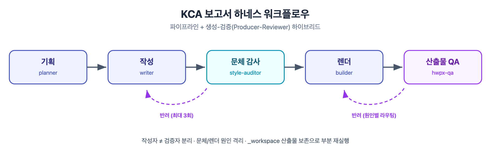

# KCA 개조식 보고서 하네스 (report-harness)

> **한 문장:** KCA(한국방송통신전파진흥원)식 **개조식 공공기관 보고서**를, 작성·검증·렌더링을 분리한 **5-에이전트 팀**으로 생산하고 최종 **HWPX(한컴 한글)** 파일까지 산출하는 Claude Code 하네스.

기존의 단일 스킬(한 주체가 작성·검증·변환을 순차 수행)을 **파이프라인 + 생성-검증(Producer-Reviewer) 하이브리드** 아키텍처로 재구성했다. 작성자와 검증자를 강제로 분리해 자기검증 편향을 제거하고, 문체 오류와 렌더링 오류를 다른 에이전트가 잡아 원인을 격리한다.



---

## 아키텍처

**파이프라인 + 생성-검증 하이브리드.** 순차 의존(기획→작성→렌더)을 파이프라인으로 두고, 품질이 중요한 두 지점에 생성-검증 반려 루프(`⇄`)를 끼운다.

```
[kca-report-orchestrator]  ← 진입점 / 조율
   │
   Phase 0  규모 라우팅(소형→기존 스킬 / 대형→팀) + 재실행 판별
   │        + 요청건 폴더 생성(claudian/reports/{날짜}_{건명}/) + 제공자료 vault INGEST-lite
   │
   Phase 1  kca-planner ─────────────────────▶ 01_planner_outline.md
   │        (3단 소스: ①제공 자료 → ②claudian 위키 → ③신규 조사(claudian-research)
   │         법령은 korean-law MCP 고정, 확정/미확정/플레이스홀더 태깅)
   │
   │        ▼ 스토리보드 승인 게이트(사용자) — 사전고지: "무엇을 쓸지·무엇을 표로"
   │          (□별 ㅇ후보 메시지·형식(서술/표/도해) 승인 → writer의 계약,
   │           수정은 계획 편집으로 즉시 소화 — opus 재작성 없이 방향 확정)
   │
   Phase 2  kca-writer  ⇄  kca-style-auditor  ▶ 02_draft / 03_auditor_report
   │        (개조식 작성,    (독립 문체 검증·반려, 최대 3회 — 기계 항목은
   │         자가 린트 게이트)  lint_report_md.py, LLM은 의미 판단만)
   │
   Phase 2.5  초안 검토 게이트(사용자) ⇄ 수정 루프 ▶ 06_feedback_round{N}.md
   │        (빌드 전 MD 초안 검토 — 스토리보드가 이미 승인됐으므로 표현 확인 성격,
   │         강화/삭제/추가자료/방향전환은 유형별 라우팅, 최대 3라운드, 생략 선택 가능)
   │
   Phase 3  kca-builder(+자가 검증) ──────────▶ 04_final.hwpx / 05_qa_report
   │        (MD→HWPX+도해, validate+parse 왕복 / 실패·양식교체 시에만 kca-hwpx-qa 스폰)
   │
   Phase 4  완료 보고 + 프로세스 지표 + 피드백(프로세스·규칙 개선 전용) → 진화
```

`⇄` = 생성-검증 반려 루프. **작성자 ≠ 검증자**를 강제해 편향을 제거한다.

---

## 집필 스토리보드 사전고지 (Phase 1 종료 게이트)

초안을 쓰기 **전에** "어떤 내용을 쓸지, 무엇을 표로 만들지"를 사용자에게 고지하고 승인받는다 — McKinsey dot-dash/고스트덱("슬라이드를 만들기 전에 스토리라인을 승인받는다"), 테크니컬 라이팅의 아웃라인 선검토(계획에 시간의 ~40%), 공공기관 목차 사전 컨센서스 관행을 하네스에 이식한 것.

- planner가 outline에 **집필 스토리보드**를 의무 산출: □(섹션)별 ㅇ후보의 **핵심 메시지 1줄**(dot — 완성 문장 아님) + **형식**(서술/표: 행수·가공형태/도해) + **뒷받침 재료**(dash — 태깅·출처).
- 사용자는 draft가 아니라 이 스토리보드를 승인/수정한다. 수정이 경미하면 계획 텍스트 편집(에이전트 호출 0회)으로 즉시 반영 — **방향 수정의 비용이 [opus writer 재작성]에서 [계획 1줄 편집]으로 내려가는 것이 핵심 속도 장치.**
- 승인본은 **writer의 계약**: 승인된 구성·형식 밖 내용 추가·형식 변경 금지(불가피한 이탈은 주석으로 명시), auditor가 **L25(스토리보드 정합)**로 검수. 미확정 확인·표 후보 채택·Phase 2.5 실행 여부도 이 게이트에서 함께 확정한다.

## 초안 검토 게이트 (Phase 2.5) — 사용자 의견 수렴 루프

문체 감사(auditor) 통과 직후, **HWPX 빌드 전에** MD 초안을 사용자에게 제시하고 내용 피드백을 받는 관문. 빌드는 파이프라인에서 가장 비싼 단계이므로 **내용이 확정되기 전에 빌드하지 않는다** — 사용자가 최종 HWPX를 받고 나서야 "이 부분 빼줘"를 말하고 빌드를 재시작하던 비용을 제거한다.

- **제시**: □ 표제 + 괄호리드 요약(30초 테스트와 동일 뷰) + `02_draft` 전문 경로 → 승인 / 수정 지시 분기.
- **수정 지시는 유형별로 기존 기계를 재사용**해 라우팅 (새 에이전트 없음):

| 피드백 유형 | 라우팅 |
|------------|--------|
| **강화** (근거·수치 보강) | planner 증분 조사(해당 항목만) → writer 패치 → auditor diff → 게이트 재진입 |
| **삭제·축소** | writer 패치 → auditor diff → 게이트 재진입 (planner 생략) |
| **추가 자료 제출** (새 파일) | INGEST-lite(모드 C) → planner 증분 갱신 → writer 패치 → auditor diff → 재진입 |
| **방향 전환** (대상·구성 변경) | `00_context.md` 갱신 → writer 재작성 → auditor → 재진입 |

- 라운드별 피드백은 `{REPORT_DIR}/06_feedback_round{N}.md`에 기록(무엇을 왜 바꿨는지 감사 추적). **상한 3라운드**, 초과 시 에스컬레이션.
- planner 증분 조사 결과는 vault `acquired/`에 적재되므로 라운드가 돌수록 조사가 싸진다(복리).
- 스토리보드 승인 시 "검토 생략·바로 최종"을 선택하면 게이트를 건너뛴다(방향이 사전 합의됐으므로 안전). 내용 피드백이 2.5에서 소화되므로 Phase 4 피드백은 프로세스·규칙 개선 전용.
- 스토리보드가 이미 승인된 상태라 이 게이트는 방향 교정이 아니라 **표현·세부 확인** 성격 — 기본 1라운드 통과를 기대한다.

---

## 5개 에이전트 (`agents/`)

| 에이전트 | 모델 | 역할 | 핵심 경계 | 산출물 |
|----------|------|------|-----------|--------|
| **kca-planner** | opus | 3단 소스(제공 자료→위키→조사) 근거 수집·태깅 + 골격 결정 | 문체 안 다듬음 | `01_outline` |
| **kca-writer** | opus | 개조식 문체 전개(명사형·2줄·괄호리드) + 제출 전 자가 린트(exit 0 게이트) | 사실 날조 안 함 | `02_draft` |
| **kca-style-auditor** | sonnet | 문체 **외부** 검증·반려(L1~L24 — 기계 항목은 `lint_report_md.py` 결과 인용, LLM은 의미 판단) | 원고 직접 수정 안 함, HWPX 안 봄 | `03_auditor_report` |
| **kca-builder** | sonnet | MD→HWPX 렌더·양식 병합·도해 주입 + 자가 검증(validate+parse 왕복) | 문체 안 건드림 | `04_final.hwpx`·`05_qa_report` |
| **kca-hwpx-qa** | sonnet | **조건부 스폰** — builder 자가 검증 실패·양식 교체·원인 판별 필요 시 독립 재검증 | 문체 판정 안 함 | `05_qa_report` |

창작·판단 중심(planner·writer)만 `opus`, 스크립트 실행·체크리스트 판정 중심은 `sonnet`. 결정론 검증(문체 기계 린트·HWPX 구조)은 스크립트가 SSOT 실행기다.

---

## 스킬 (`skills/`)

| 스킬 | 역할 |
|------|------|
| **kca-report-orchestrator** | 진입점. 자료 입력 수집·규모 라우팅·파이프라인·생성-검증 루프·부분 재실행·진화 조율 |
| **kca-report-layout** | **규칙 SSOT** — 본문 2p·□당 ㅇ≤3·통합·붙임(최소 1p)·용어 각주(ㅇ당 `*`≤1+`※`≤1)·BLUF·대상 프로파일·워크플로우 도해 |
| **kca-style-lint** | **탐지 SSOT** — 개조식 린트 체크리스트 L1~L24. 기계 판정 항목은 `lint_report_md.py`가 1차 판정기 |
| **kca-report-style** | 개조식 규칙 지식 베이스 + HWPX 변환 스크립트/참고양식. 소형 1페이지 보고서는 이 스킬이 단독 처리 |
| **claudian-research** | **글로벌 자료조사·위키 참조** — claudian vault(사전지식 위키)를 어느 디렉토리에서든 사용. 모드 A: 위키 페이지 인용(원출처 병기), 모드 B: 병렬 조사 후 vault `acquired/`에 적재(복리 축적) |

> **SSOT 분담:** 규칙의 *임계값·방법*은 `kca-report-layout`이 유일 원천, `kca-style-lint`는 그것을 *탐지·판정*. 규칙 변경 시 layout을 먼저 고치고 lint·에이전트는 참조만 갱신한다.

---

## 스크립트 (`skills/kca-report-style/scripts/`)

| 스크립트 | 하는 일 |
|----------|---------|
| `lint_report_md.py` | **개조식 MD 기계 린트** — L1·L4·L7·L11~L13b·L16·L19·L22·L23(본문 표 행≤8)·L24(법령 한국식) 결정론 판정 + 휴리스틱 경고(L2·L3·L5·L6·L15·L17·L18). writer 자가 게이트·auditor 1차 판정기 |
| `prep_report_md.py` | HWPX 변환 전 결정론적 전처리 — 각주 `* `→전각 `＊ ` 치환, 표 폭 지시자 추출(`table_widths.json`), 도해 마커 보존 |
| `build_from_template.py` | 참고양식(레터헤드·그라데이션·계층 글꼴) 병합. `＊`를 각주 스타일(맑은고딕12)로 재지정 |
| `adjust_table_widths.py` | 표 열 폭을 셀 내용 표시폭 비례로 재분배 + 행 높이 재계산(하한 8%·상한 5:1·표 폭 보존, rowCnt=1 제목·라벨박스 표 제외) |
| `postprocess.py` | 참고양식 없이 단독 생성 시 폴백 렌더 경로 |
| `inject_image.py` | 워크플로우 도해 PNG를 HWPX BinData에 주입(`--marker` 위치 치환, 결정론 id, `hc` 네임스페이스 자동 선언) |
| `validate_hwpx.py` | 스타일 id 연속성·IDRef 범위·표 행 폭 합계·zip/xml 무결성 검사(렌더 불가 환경의 "조용한 실패" 방어선) |

---

## 워크플로우 도해 파이프라인 (SVG → PNG → HWPX)

HWPX(kordoc)는 이미지를 못 만들고 표·텍스트만 렌더하므로, 흐름도는 아래 4단계로 주입한다. 외부 의존(Figma·plan key) 없이 **로컬 도구만** 사용:

1. **SVG 직접 작성** — 정사각 캔버스(가로 클리핑 방지), 상단 배치
2. **`qlmanage`** (macOS 네이티브) — SVG → PNG 래스터화
3. **Pillow** — 비-흰색 크롭 + 흰 여백
4. **`inject_image.py --marker "도해"`** — MD의 `[도해: …]` 문단을 그림으로 치환(정확 위치 배치)

---

## 설치

Claude Code 전역(`~/.claude/`)에 배치한다:

```bash
git clone https://github.com/bcchung81/report-harness.git
cd report-harness
# 에이전트
cp agents/*.md ~/.claude/agents/
# 스킬
cp -R skills/* ~/.claude/skills/
```

플러그인으로 설치하려면 마켓플레이스에 추가:

```
/plugin marketplace add bcchung81/report-harness
```

---

## 사용

```
KCA 보고서 하네스로 써줘
2026 직원 AI 역량강화 교육계획을 개조식 보고서로 만들어
이 초안을 KCA 개조식 HWPX로 변환해줘
```

실행 중 사용자 게이트는 두 번 열린다: ①기획 직후 **스토리보드 승인**("이 구성·이 내용·이건 표로 갑니다" 사전고지 → 승인/수정 지시 — 여기서 방향을 확정) ②문체 감사 통과 후 **초안 검토(Phase 2.5)** — MD 초안을 확인하고 승인하거나 "이 섹션 보강해줘 / 이 표는 빼줘 / 이 자료도 반영해줘"로 수정을 지시하면 유형별 루프가 돈 뒤 빌드된다(스토리보드 승인 시 생략 선택 가능).

후속 작업(부분 재실행 — writer는 전면 재작성이 아니라 기존 draft 패치, auditor는 diff 재감사):

```
표만 다시          → writer(패치)→auditor(diff)→builder, outline·draft 재사용
문체만 재검수       → style-auditor만
HWPX만 다시 뽑아    → builder(자가 검증 포함)만
```

---

## 요구사항

- **Claude Code** — 에이전트 팀 모드는 `CLAUDE_CODE_EXPERIMENTAL_AGENT_TEAMS=1`(없으면 서브에이전트 파이프라인으로 자동 폴백)
- **kordoc MCP** — MD↔HWPX 변환·파싱(`generate_document`·`parse_document`)
- **korean-law MCP** — 법령·규정 근거 수집(선택)
- **deep-research · firecrawl · insane-search 스킬** — 동향·통계 근거 수집(선택)
- **claudian vault** (`~/workspace/claudian`) — 사전지식 위키 인용·조사 결과 적재(`claudian-research` 스킬 사용 시)
- **macOS** — `qlmanage`(SVG 래스터, 도해 사용 시)
- **Python 3 + Pillow** — 도해 크롭

---

## 결정론적 안전망 — 훅 (선택)

하네스는 기본적으로 훅 없이 동작하지만(모델 주도), **HWPX 구조 검증을 결정론적으로 강제**하는 훅을 넣을 수 있다. hwpx-qa 에이전트가 `validate_hwpx.py` 실행을 건너뛰어도, `build_from_template.py`·`inject_image.py`를 부른 Bash 명령이 만든 HWPX는 이 훅이 무조건 검증한다.

`~/.claude/settings.json`의 `hooks.PostToolUse`에 추가(기존 훅과 **병합**):

```json
{
  "matcher": "Bash",
  "hooks": [
    {
      "type": "command",
      "command": "python3 \"/Users/<you>/.claude/kca-harness/hooks/validate_hwpx_hook.py\"",
      "timeout": 30,
      "statusMessage": "HWPX 구조 검증"
    }
  ]
}
```

훅 스크립트는 `hooks/validate_hwpx_hook.py`. 구조 검증 실패 시 `decision:block`으로 모델에 재빌드를 알린다(정상이면 조용히 통과). 이것으로 "QA 에이전트가 건너뛰어도 검증은 무조건 실행"되는 안전망이 완성된다 — 감사에서 지적한 취약 커플링을 훅이 결정론적으로 메운다.

## 설계 원칙

1. **작성자 ≠ 검증자** — writer와 style-auditor를 다른 에이전트로 강제 분리(자기검증 편향 제거)
2. **문체 검증 ≠ 렌더 검증** — auditor(문체) / hwpx-qa(구조)로 원인 격리
3. **에이전트=누가 / 스킬=어떻게** — 재사용성의 원천
4. **이중 트랙** — 소형은 단일 스킬, 대형만 하네스(과설계 방지)
5. **부분 재실행·복리** — 산출물은 claudian vault `reports/{날짜}_{건명}/`에 요청건별 영구 누적(최종본은 그 안의 `final/`), 완성 보고서는 위키 topics/ 페이지로 지식화
6. **진화하는 시스템** — 매 실행 후 피드백을 규칙(SSOT)에 반영, 변경 이력 기록

---

## 산출물 예시

`examples/sample-report.hwpx` — 이 하네스로 생성한 실제 보고서(레터헤드·워크플로우 도해·용어 각주·붙임 포함).

---

## 라이선스

Apache-2.0
