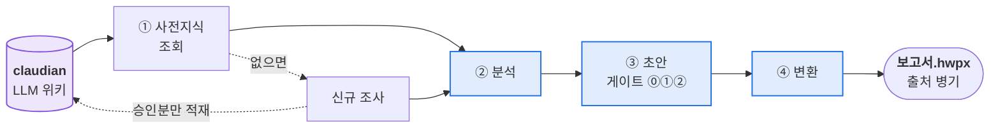
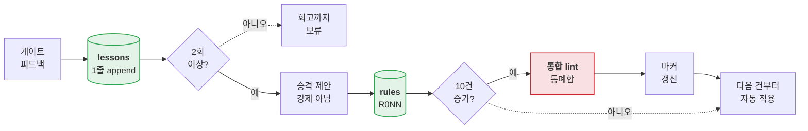

# report-harness

**망분리 환경에서, 한 번 찾은 자료로 계속 보고서를 쓰는 파이프라인.**

[](LICENSE)


> **소개 발표자료(슬라이드 7장 · 약 3분 30초)** — <https://report-harness-deck.vercel.app>
> 화살표 키로 넘기거나, `A` 키를 누르면 음성 낭독과 함께 자동 진행됩니다.

---

## 내가 불편해서 만들었다

솔직히 그게 처음이었다. 거창한 계획이 아니라 매번 같은 노가다를 반복하는 게 지겨웠다.

망이 분리돼 있으면 이렇게 된다. 조사도 작성도 인터넷망에서 한다. 업무망으로 넘어가는 건 완성된
파일 하나뿐이다. 그래서 인터넷망 안에서 자료를 md로 긁어 모으고, 붙여넣고, 한글을 열어 글머리
기호를 맞추고, 서체를 바꾸고, 표 폭을 줄이고, 각주를 손보고, 붙임 배너를 단다. 내용은 이미 다
있는데 **옮기고 꾸미는 데 시간이 다 간다.**

문제는 도구를 깔 자리가 없다는 것이다. 대부분은 인터넷망 VDI에서 일하는데, 거기에 개발 환경을
설치할 수는 없다.

그러다 완성한 hwpx가 업무망 반입에서 반려된 적도 있다. 파일은 멀쩡한데 자료교환 시스템이
hwpx로 알아보지 못했다. 패키지 안에 `version.xml`이 없어서 일반 압축파일로 판정된 것이었다.
그 건은 규칙 R043으로 박아뒀다.

## 그래서 세 가지를 없애기로 했다

**옮기는 노가다.** md를 유일한 원본으로 삼는다. 자료를 모을 때도 md, 위키에 쌓일 때도 md,
hwpx로 나갈 때도 md에서 출발한다. 변환은 스크립트가 하고 사람은 손대지 않는다. 그 스크립트는
파이썬 표준 라이브러리만 쓴다 — 웹앱 샌드박스에서 `pip` 없이 돌아야 하기 때문이다.

**다시 찾는 노가다.** 조사한 것은 위키에 남는다. 다음 보고서는 검색창이 아니라 그 위키에서
출발한다. 쌓이는 게 일반 지식이면 별 소용이 없었을 텐데, 여기 남는 건 성격이 다르다. 구글은
누구에게나 같은 답을 준다. 위키에는 우리 기관 평가지표에 걸리고, 작년 지적사항에 엮이고,
내부 규정에 붙은 형태로만 남는다. 같은 "AI 성과측정"이라도 내 업무 맥락을 통과한 버전이다.

**배우는 노가다.** 이걸 나만 쓰면 의미가 없다. 옆자리 실무자가 터미널이며 git이며 MCP를
공부해야 한다면 아무도 안 쓴다. VDI에는 그럴 환경도 없다. 그래서 웹앱용 스킬을 따로 뽑았다.
브라우저에 파일 하나 올리고 대화창에 자료를 붙여넣으면 된다. 판단이 필요한 지점은 아웃라인과
초안, 두 번뿐이다.

나 자신은 개발 노트북에서 하네스 쪽을 쓴다. 조사·분석까지 붙어 있고 규칙이 쌓이니까. 다만
그렇게 쌓인 규칙은 나만 갖고 있으면 소용이 없어서, 주기적으로 웹앱 스킬에 실어 다시 배포한다.

## 파이프라인


```mermaid
flowchart LR
    W[("<b>claudian</b><br/>LLM 위키")]
    Q["① 사전지식<br/>조회"]
    N["신규 조사"]
    A["② 분석"]
    D["③ 초안<br/>게이트 ⓪①②"]
    X["④ 변환"]
    F(["<b>보고서.hwpx</b><br/>출처 병기"])

    W --> Q --> A --> D --> X --> F
    Q -.->|"없으면"| N --> A
    N -.->|"승인분만 적재"| W

    classDef vault fill:#8250df22,stroke:#8250df,stroke-width:1.5px
    classDef stage fill:#1f6feb22,stroke:#1f6feb,stroke-width:1.5px
    class W vault
    class A,D,X stage
```

왼쪽 끝 위키가 출발점이면서 도착점이다. 조사는 위키를 먼저 뒤지고, 없는 것만 새로 찾는다.
새로 찾은 것도 전부 들어가지는 않는다 — **사람이 승인한 것만** 위키로 돌아간다. 출처가
불분명하면 거기서 걸러진다.

그래서 쓸수록 왼쪽이 두꺼워지고 오른쪽에서 찾을 게 줄어든다.

끝에 나오는 건 기관 양식에 맞춘 `.hwpx`다. 글머리 계층(`□`→`ㅇ`→`-`), 서체와 크기, 줄간격,
표 폭 정합, 각주, 붙임 배너, 머리말까지 후처리가 맞춘다. 다만 진짜 원본은 마크다운
초안(`20_draft.md`) 쪽이고, 변환이 실패해도 초안은 반드시 인도된다.

## "이 숫자 어디서 나왔냐"

보고서를 올리면 결국 이 질문을 받는다. 답을 못 하면 그 문단은 통째로 흔들린다.

하네스는 이 질문을 다섯 지점에서 미리 막는다.

| 지점 | 무엇을 하나 |
|---|---|
| 조사 | 산출물마다 원출처 프론트매터 + `_manifest.jsonl`. 출처 불명 자료는 아예 적재하지 않는다 |
| 위키 인용 | 원출처가 추적되면 `[확정]`, 위키에만 있으면 `[미확정]` |
| 초안 | 초안의 수치를 조사 폴더와 대조해 근거 없는 값(`numbers-unsourced`)을 잡아낸다 |
| 변환 | 구조 검증 + 왕복 대조. 어긋난 게 남으면 조용히 내주지 않고 목록을 보고한 뒤 md를 넘긴다 |
| 회귀 | 같은 지적이 반복되면 규칙으로 승격돼 다음 보고서에 자동으로 걸린다 (현재 R001~R094, 결번 포함) |

옮기는 수고를 줄이려고 시작했는데, 줄이고 보니 남는 게 하나 더 있었다. 근거가 문서에 붙어서
나온다는 것. 손으로 옮길 때는 출처가 중간에 떨어져 나갔다.

## 4단계 안에서 무슨 일이 일어나나

| 단계 | 하는 일 | 산출물 | 기계 시간 |
|---|---|---|---|
| **① research** | 제공자료 적재 · 위키 조회 · 신규조사 | `research/` + `_manifest.jsonl` | — |
| **② analyze** | 조사 결과 종합 | `05_analysis.md` | 5분 |
| **③ draft** | 개조식 초안 (게이트 3개가 전부 여기) | `10_outline.md` → `20_draft.md` | 10분 |
| **④ export** | 팩트체크 ∥ 회귀검사 → 양식 정합 변환 | `final/{제목}.hwpx` + `40_qa.md` | 5분 |

상한이 임박하면 조사 팬아웃 축소 → 분석 팬아웃 축소 → 감사 1패스화 → 팩트체크 경량 강등 순으로
스스로 줄인다. 전 구간 30분을 넘기면 설계 실패로 보고 소요 구간을 기록한다.

사람이 끼어드는 건 세 번뿐이고, 전부 선택지 클릭형이다. "어떻게 할까요" 같은 열린 질문은 던지지
않는다.

| 게이트 | 시점 | 묻는 것 |
|---|---|---|
| **⓪** | ③ 시작 | 보고서 유형 · 수신자 격·분량 · **산출물 요구** · 논지 방향 · **상황 전제**(이미 발주했는지·대응할 지적·먼저 볼 상위 계획서) (최대 4문항, 답이 이미 명확하면 건너뜀) |
| **①** | 아웃라인 완성 | 승인 / 수정 지정 / 방향 전환. 논지가 갈리면 2안을 만들어 고르게 한다 |
| **②** | 초안 완성 | 승인 + 팩트체크 범위. 수정은 절 주소로 한 줄 — `"□3 ㅇ2 수치 중심으로"`. 예상 쪽수가 분량을 넘으면 줄일 곳도 여기서 고른다 |

조사 단계는 **방법을 강제하지 않는다.** 도구는 환경에 있는 걸 골라 쓰고, 없으면 건너뛴다.
강제되는 건 산출물이 계약대로 쌓이는 것뿐이다 — 원문 발췌로 수집하고(의역 금지), 확정과 추정을
갈라 태깅하고, 이미 확보한 근거는 다시 조사하지 않는다.

초안은 **한 컨텍스트에서 통으로 쓴다.** 절별로 쪼개 병렬로 쓰면 문체와 논지가 갈린다 — 하네스
전체의 금기 둘 중 하나다. 다 쓰면 린트가 변환 가능 규격을 검사하고, 통과할 때까지 고친 뒤에야
사용자에게 보인다.

## 양식은 후처리가 맞춘다

변환기가 뱉은 hwpx는 아직 기관 양식이 아니다. 그래서 뒤에 후처리가 붙어 있다.

```
prep 정규화 → hwpx 생성 → ★ postprocess_hwpx.py --all
   → 구조 검증 → 왕복 되읽기 → 내용 대조
```

이 스크립트가 hwpx XML을 직접 고쳐 계층 간격·정렬·서체·캡션·표 폭·머리말 배너·발신 줄 크기를
맞춘다. 적용 규칙이 40개를 넘고, 목록은 [rules-seed.md](skills/report-pipeline/references/rules-seed.md)에
있다. 건너뛰면 규칙 위반본이 그대로 나간다.

대조에서 어긋난 게 나오면 두 번까지 다시 변환하고, 그래도 남으면 목록을 밝힌 뒤 `20_draft.md`를
그대로 넘긴다. 틀린 hwpx를 조용히 내주지는 않는다.

## 쓸수록 좋아진다


```mermaid
flowchart LR
    A["게이트<br/>피드백"]
    B[("<b>lessons</b><br/>1줄 append")]
    C{"2회<br/>이상?"}
    D["회고까지<br/>보류"]
    E["승격 제안<br/>강제 아님"]
    G[("<b>rules</b><br/>R0NN")]
    I{"10건<br/>증가?"}
    J["<b>통합 lint</b><br/>통폐합"]
    K["마커<br/>갱신"]
    H["다음 건부터<br/>자동 적용"]

    A --> B --> C
    C -->|"예"| E --> G --> I
    C -.->|"아니오"| D
    I -->|"예"| J --> K --> H
    I -.->|"아니오"| H

    classDef acc fill:#2da44e22,stroke:#2da44e,stroke-width:1.5px
    classDef gc fill:#d1242f22,stroke:#d1242f,stroke-width:1.5px
    class B,G acc
    class J gc
```

규칙에는 단계 태그(`[research]`/`[analyze]`/`[draft]`/`[export]`)가 붙고, 각 단계는 자기 태그만
읽는다. 첫 실행 때 시드(현재 88건)가 복사돼 출발점이 되고, 플러그인을 갱신하면 새로 온 규칙만 운영본 끝에
덧붙고, 손대지 않은 옛 시드 줄은 새 줄로 바뀐다(시드에서 폐지됐으면 지워진다) — 설치자가 고치거나 쌓은 규칙은 번호가
겹쳐도 건드리지 않는다(`sync_rules.py`, 옛 시드 줄은 배포한 줄 지문 `rules-seed.lineage.json`으로 가린다). 교훈에는 종류(`kind` — 내용·결함·기능·선호)가
붙어, 규칙 승격은 내용 교훈만 타고 결함·기능은 고친 커밋(`resolved_by`)이 붙을 때까지 자가진단에 남는다.

다만 쌓기만 하면 안 된다는 걸 겪었다. 규칙이 두 달에 43건까지 늘자 길어서 안 읽히고, 안 읽히니
안 지켜지고, 그래서 같은 실수가 또 박제되는 순환이 생겼다. 지금은 네 장치가 물려 있다.

| 장치 | 하는 일 |
|---|---|
| **근거 등급** | 근거란에 `[실측]`·`[추론]`·`[관례]`를 단다. 검증 없는 '1줄 75자'가 넉 달간 모든 문서를 3~4줄로 만든 사고가 계기다 |
| **값 드리프트 탐지** (R066) | 같은 값이 최대 8곳에 복제돼 있어 한 곳만 고치면 나머지가 거짓말을 시작한다. 단일 출처와 코드 상수를 테스트가 대조한다 |
| **정기 통폐합** (R068) | 마지막 통합 이후 10건이 늘면 테스트가 실패한다. 자동 병합은 하지 않는다 — 기계가 판정할 수 있는 건 피참조 0건까지다 |
| **경위 분리** (0.6.0) | 규칙 본문에는 따를 값만 두고 사고 경위는 `rules-history.md`로 옮긴다. 88건 중 66건을 정리해 단계마다 읽는 분량이 약 5분의 1 줄었다([draft] −24%·[export] −21%) |

폐지된 규칙은 번호를 재사용하지 않고 결번으로 남긴다. 판단 근거를 지우면 같은 실수가 돌아온다.
원인 판단이 뒤집히면 앞 규칙에 `[… 정정됨 → R0NN]` 표기를 단다. 이걸 빼먹은 적도 있다 — R030은 제목표 위 여백의
'확정 원인'을 머리말 부재로 적었는데, 같은 날 이어진 조사에서 실제 원인은 표 폭이 본문 폭과 딱 맞아 생긴 줄바꿈
빈 줄(R042)과 배너 앵커 줄간격(R041)으로 밝혀졌다. 표기가 없어 두 달 가까이 틀린 서술이 유효하게 남아 있다가 규칙
문구를 정리하면서 드러났다. 배너를 넣는 지시는 맞으니 규칙은 두고 원인 서술만 바로잡았다.

규칙을 바꿀 때는 실전 점검(`scripts/smoke_pipeline.py`)으로 현행판과 나란히 돌려 본다. 가상 자료로 조사부터 hwpx까지
무인으로 돌리고 결과를 기계로 채점한다. 규칙 문구 정리도 이렇게 A/B로 확인하고 채택했다.

## 폴더가 맥락을 기억한다

건별로 작업폴더가 하나 생기고, 각 단계는 이 폴더를 인터페이스 삼아 읽고 쓴다.

```
{reports_dir}/20260729/1430_AI성과측정체계/
├── 00_context.md              요구사항·게이트 답변 누적
├── research/
│   ├── provided/              받은 자료 원본 + 파싱본(.md)
│   └── fetched/{topic}/       조사 단위 1개 = 폴더 1개
│       ├── _manifest.jsonl    산출물 1건당 1줄 (출처·시각·도구·확정/추정)
│       ├── {source}.md        프론트매터로 원출처 명시, 원문 발췌
│       └── images/            이미지 후보 원본
├── 05_analysis.md             논지 후보 · 총괄표 후보 · 근거 공백
├── 10_outline.md              목차·논지·근거·표·도식 설계
├── 20_draft.md                개조식 초안 — 이 파일이 진짜 원본
├── 35_factcheck.md            팩트체크 결과 (전수 선택 시)
├── 40_qa.md                   검증 리포트
└── final/{제목}.hwpx          최종 산출물
```

세션이 끊겨도 `"이어서 해줘"` 한 마디면 폴더 상태를 읽고 그 지점부터 잇는다. 새 폴더를 만들지
않는다 — 세션이 아니라 폴더가 맥락을 갖고 있기 때문이다.

## 저장소 구조

```
report-harness/
├── .claude-plugin/          플러그인·마켓플레이스 정의
├── .mcp.json                번들 MCP 2종 (kordoc · korean-law)
│
├── skills/
│   ├── report-pipeline/     ★ 4단계를 지휘하는 오케스트레이터
│   │   ├── SKILL.md         단계 흐름·게이트·시간예산
│   │   ├── references/      ← 판단 기준 (LLM이 읽는다)
│   │   │   ├── style-guide.md          실보고서 34건에서 뽑은 문체 관례
│   │   │   ├── md-profile.md           변환 가능한 마크다운 규격 + 린트 15종
│   │   │   ├── format-profile.kca.md   기관 양식 실측 프로파일
│   │   │   ├── hwpx-recipe.md          변환 절차서
│   │   │   ├── rules-seed.md           회귀 방지 규칙 88건 (복리축적 시드)
│   │   │   ├── rules-seed.lineage.json 배포한 시드 줄 지문 — 설치자 규칙 갱신 판정
│   │   │   ├── rules-history.md        규칙 경위·결번 기록
│   │   │   ├── report-craft.md         보고서 설계 지침 — 목적·결론·근거 구조 (R094)
│   │   │   ├── diagram-pool.md         도식 패턴 — 표 도식·인용 차트·외부 인용
│   │   │   └── table-pool.md           표 부품 카탈로그
│   │   ├── scripts/         ← 결정론 도구 (판단이 끼면 안 되는 것)
│   │   │   ├── postprocess_hwpx.py     ★ 양식 정합 후처리
│   │   │   ├── validate_hwpx.py        구조·대조·수치 검증
│   │   │   ├── lint_md_profile.py      초안 규격 검사
│   │   │   ├── prep_report_md.py       변환 전 정규화
│   │   │   ├── audit_style.py          문체 감사 — 종결어미·쉬운 말·도식 문장·출처 줄
│   │   │   ├── diagram_table.py        도식 명세 → 한글 표 (흐름·비교·체계·일정)
│   │   │   ├── review_server.py        라이브 리뷰어·허브 (게이트①·② 코멘트 → CLI)
│   │   │   ├── check_craft.py          보고 설계·설계 점검 칸 검사
│   │   │   ├── sync_rules.py           규칙 시드 → 운영본 동기화 · 새 규칙 번호
│   │   │   ├── consolidate_rules.py    규칙 통폐합 lint
│   │   │   ├── doctor.py               자가진단
│   │   │   └── …                       설정·이미지 규격·프로파일 추출
│   │   └── assets/          기관 표준 양식 · 도식 Pool · 머리말 배너 · 리뷰어 화면
│   ├── report-research/     ① 조사 — 방법은 자유, 산출 계약만 강제
│   ├── report-writing/      보고서 설계 지침 입구 — report-craft.md를 따로 부른다
│   ├── cross-verify/        교차검증 — 다중 CLI 패널 + 수치 근거 대조
│   │   └── scripts/verify_claims.py   패널이 지어낸 수치·오귀속 검출
│   └── humanizer/           윤문 — AI 문체 흔적 제거 (MIT © DaleSeo)
│
├── commands/                슬래시 커맨드 7종
├── hooks/                   안전망 훅 2종 — hwpx 검증 우회 차단 · 초안(20_draft.md) 린트
│
├── webapp/kca-report-hwpx/  ★ 웹앱 배포판 원본 — MCP 없이 자립
│   ├── SKILL.md             ③초안 게이트 최대 3회 → ④변환 자동
│   ├── NOTICE.md            서드파티 고지
│   ├── scripts/             md2hwpx(생성) · assert_postprocess(침묵실패 차단)
│   │                        · roundtrip_md(되읽기) + 하네스 복사본 5종
│   ├── references/          하네스 참조 사본(보고서 설계 지침 포함) + humanizer 번들
│   └── assets/              동결 스타일 정본 · 머리말 배너
│
├── docs/                    설치·라이선스·개발자 문서
├── scripts/                 배포 가드 + 5플랫폼 패키지 빌드 (claude·chatgpt·gemini·codex·antigravity) + 시드 계보 갱신
│                            + 실전 점검(헤드리스 전 구간 + 결정론 채점)
└── tests/                   pytest 회귀 스위트 — CI가 매 push 실행
```

## 설계 원칙 셋

**판단은 문서로, 실행은 스크립트로.** `references/`는 LLM이 읽고 판단하는 기준이고,
`scripts/`는 판단이 끼어들면 안 되는 일을 한다. 양식 정합처럼 매번 똑같아야 하는 건 전부
스크립트로 내려 LLM 편차를 없앴다.

**조사는 방법을 강제하지 않는다.** 요구하는 건 산출 계약뿐이다. 그래서 도구가 하나도 없어도
파이프라인이 멈추지 않는다.

**규칙은 복리로 쌓되 상한을 건다.** 위의 네 장치가 그 상한이다.

## 세 조각

따로 써도 되고, 셋을 붙이면 위 파이프라인이 완성된다. 실제로는 **B와 C는 개발 노트북에,
A는 VDI 브라우저에** 놓는 형태로 갈린다.

| | **C. claudian**<br/>지식 위키 | **B. report-harness**<br/>하네스 | **A. kca-report-hwpx**<br/>웹앱 스킬 |
|---|---|---|---|
| 역할 | 지식을 쌓고 재인용 | 조사→분석→초안→변환 | 초안 + hwpx 변환 |
| 대상 | 자료를 계속 다루는 사람 | 운영자 | 실무자 |
| 쓰는 곳 | 개발 노트북 (터미널 + Obsidian) | 개발 노트북 (Claude Code) | **VDI 브라우저** — claude.ai · ChatGPT · Gemini |
| 설치 | 저장소 클론 | 플러그인 + MCP | **스킬 파일 하나** |
| 축적 | **지식** (acquired→wiki) | **규칙** (lessons→rules) | 없음 (정적) |
| 없으면 | 신규 조사만 수행 | — | — |
| 저장소 | [bcchung81/claudian](https://github.com/bcchung81/claudian) | 이 저장소 | 이 저장소 `webapp/` |

VDI에서 일하는 실무자라면 **A만** 주면 된다. 브라우저에 파일 하나 올리면 초안부터 hwpx까지 나온다.
보고서를 자주 쓰는 사람은 **B**를 쓴다. 규칙이 쌓여서 같은 지적을 점점 덜 받는다. 같은 주제를
계속 다룬다면 **B에 C를 붙인다** — 그래야 위 그림이 실제로 돈다.

A와 B를 겹쳐 쓰는 게 정상 운영이다. B에서 규칙이 쌓이면 그 규칙을 실어 A를 다시 빌드해
실무자에게 배포한다. 웹앱판은 세션 사이에 아무것도 기억하지 못해서, 재배포 말고는 축적을
전달할 방법이 없다.

## 어떻게 부르나

말로 하면 된다.

| 이렇게 말하면 | 이렇게 돈다 |
|---|---|
| `"○○ 동향 조사해서 보고서 만들어줘"` | ①②③④ 전 구간 |
| `"이 자료들 참고해서 초안 만들어줘"` + 파일 | ②③ |
| `"hwpx로 변환해줘"` | 승인된 초안이 있으면 ④만 |
| `"이어서 해줘"` | 마지막 작업폴더를 찾아 그 지점부터 |

단계를 직접 짚고 싶으면 `/report-research` · `/report-analyze` · `/report-draft` ·
`/report-export`를 쓴다. 진단은 `/report-doctor`, 리뷰 화면을 직접 열 때는 `/report-review`. 보고서 짜임새만 점검하고 싶으면 `"이 아웃라인 설계 점검해줘"` —
`report-writing` 스킬이 목적·결론·근거 구조 지침(`report-craft.md`)으로 본다.

게이트①·②의 아웃라인과 초안은 **라이브 리뷰어**(`http://127.0.0.1:3333`)에서 본다. 한글 양식에 가깝게(쪽 경계·예상
쪽수) 그려진 문서에서 문단을 골라 코멘트를 남기면 CLI가 받아 고치고, 고친 항목만 화면에 다시 그린다. 외부로 나가는
전송은 없다. 리뷰어를 띄우지 않을 때도 초안 렌더러가 변환 뒤 후처리와 같은 식으로 예상 쪽수를 내서, 분량이 넘치는지
승인 전에 안다. 게이트 밖에서 다시 보고 싶으면 `/report-review`로 연다 — 인자가 없으면 가장 최근 건,
`all`이면 리뷰 중인 건 전부, `닫기`면 그 건의 리뷰를 닫는다.

## 시작하기

| | 설치 문서 | 첫 명령 |
|---|---|---|
| **하네스** — 개발 노트북, 전 구간 | [docs/install-harness.md](docs/install-harness.md) | `/plugin install report-harness@report-harness` |
| **웹앱 스킬** — Claude·ChatGPT·Gemini | [docs/install-webapp.md](docs/install-webapp.md) | 스킬 파일 하나 업로드 |
| **claudian 위키** — 선택 | [bcchung81/claudian](https://github.com/bcchung81/claudian) | 별도 저장소 `INSTALL.md` |

이미 설치했다면 갱신은 `claude plugin marketplace update report-harness` → `claude plugin update report-harness@report-harness`
→ Claude Code 재시작. 첫 요청에서 운영 규칙이 새 판에 맞춰진다(직접 쌓은 규칙은 그대로). 판마다 바뀐 것은
[CHANGELOG](CHANGELOG.md)와 [릴리스](https://github.com/kca-deep/report-harness/releases)에 있다.

더 들어가려면 — [의존성과 라이선스](docs/licenses.md)에 원작자 고지 전문이,
[개발자용](docs/developing.md)에 로컬 검증·패키징·테스트가 있다.

## 라이선스·원작자

MIT © 2026 bcchung81, 전문은 [LICENSE](LICENSE). 하네스가 만든 **보고서의 저작권은 작성자에게
있다** — 라이선스는 도구에만 걸린다.

빌려 쓴 것은 전부 원작자를 밝힌다. 상세는 [docs/licenses.md](docs/licenses.md).

| 저작물 | 원작자 | 라이선스 | 구분 |
|---|---|---|---|
| `humanizer` | [DaleSeo](https://github.com/DaleSeo) | MIT | 번들 (LICENSE 동봉) |
| `kordoc` | [chrisryugj](https://github.com/chrisryugj) | MIT | 실행 시 npx (`kordoc@4.15.3` 고정 — 새 판은 실전 점검 뒤 올림) |
| `korean-law-mcp` | [chrisryugj](https://github.com/chrisryugj) | MIT | 실행 시 npx |
| `insane-search` | [fivetaku](https://github.com/fivetaku) | MIT | 별도 설치 |
| `python-hwpx` | [airmang](https://github.com/airmang) | Apache-2.0 | 별도 설치 (선택) |

법제처 인증키, 기관 서식 자산, 상용 글꼴은 코드와 조건이 다르다. 대외 배포 전에
[docs/licenses.md](docs/licenses.md)를 확인할 것.
